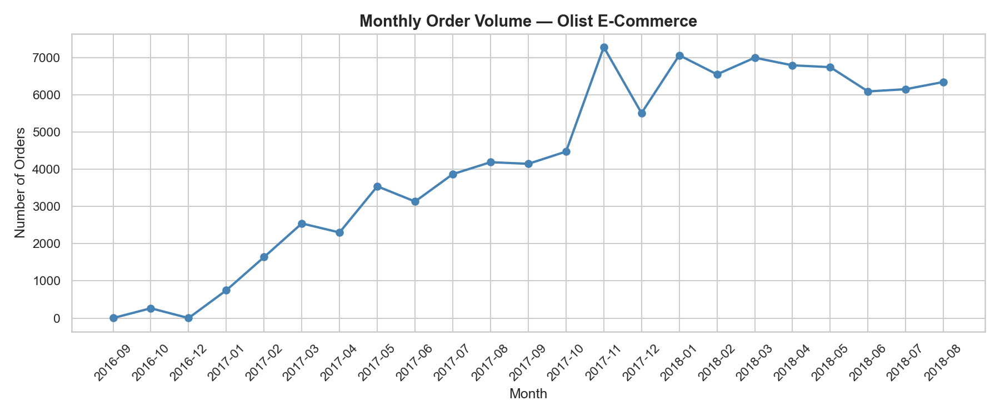
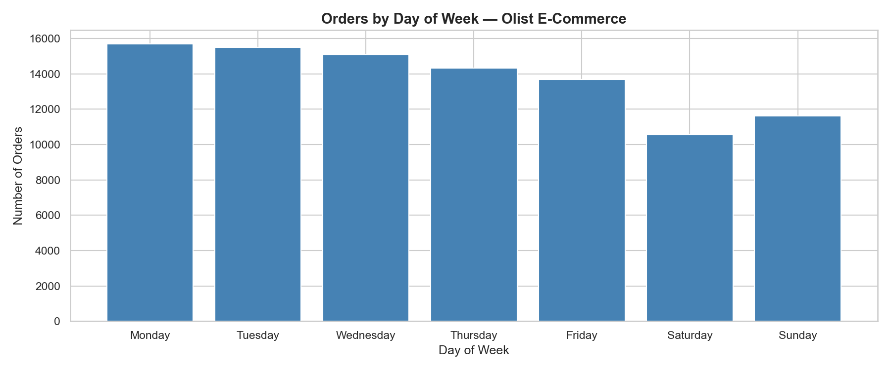
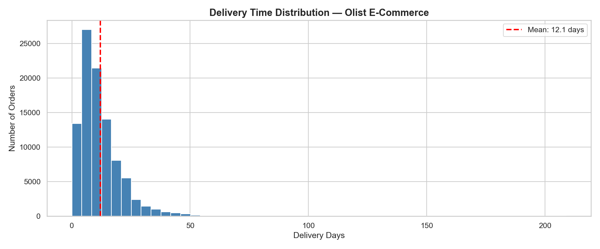
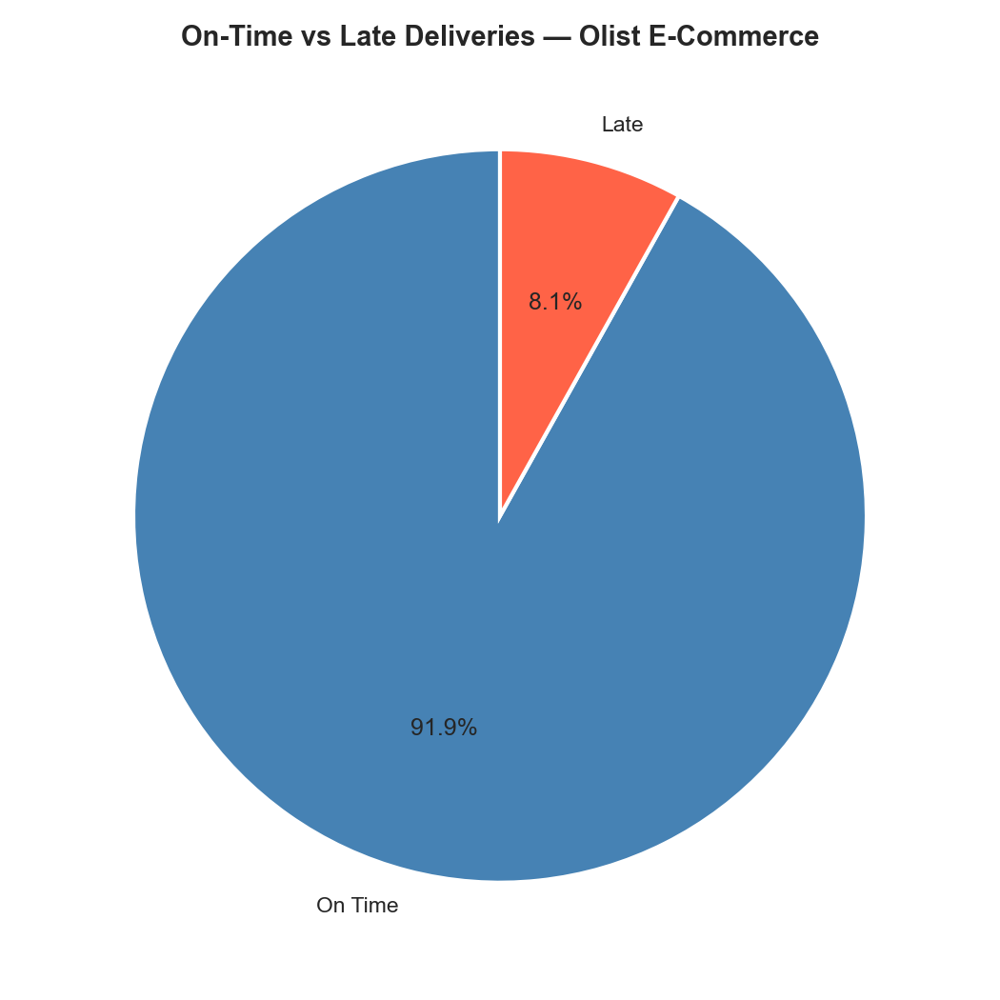

# 🛒 E-Commerce Sales Analysis — Olist Brazil

## Project Overview
Exploratory data analysis of 99,000+ real e-commerce orders 
from Olist, Brazil's largest online marketplace. This project 
uncovers sales trends, customer behavior patterns, and 
operational insights from raw transactional data.

---

## Business Questions Answered
- Is the business growing over time?
- When do customers prefer to shop?
- How fast are orders being delivered?
- How often does the business fail its delivery promises?

---

## Dataset
- **Source:** [Olist Brazilian E-Commerce — Kaggle](https://www.kaggle.com/datasets/olistbr/brazilian-ecommerce)
- **Size:** 99,441 orders (2016–2018)
- **File used:** `olist_orders_dataset.csv`

---

## Tools & Libraries
- Python 3
- Pandas — data cleaning & manipulation
- Matplotlib & Seaborn — visualizations
- Jupyter Notebook — analysis environment

---

## Project Structure
```
project-01-ecommerce/
│
├── data/                    # Raw and cleaned data (not tracked by Git)
├── notebooks/
│   ├── 01_data_audit.ipynb        # Initial data quality check
│   ├── 02_data_cleaning.ipynb     # Cleaning & feature engineering
│   └── 03_eda_and_visualizations.ipynb  # Analysis & charts
├── images/                  # Saved chart outputs
└── README.md
```

---

## Key Findings

### 📈 Finding 1 — Strong Growth Trajectory
Orders grew from near zero in late 2016 to ~7,000/month by 2018.
A clear spike in November 2017 suggests a **Black Friday seasonality effect.**



### 📅 Finding 2 — Weekday Shopping Dominates
Monday is the peak shopping day (~15,700 orders).
Saturday sees the least activity (~10,500 orders).
**Recommendation:** Run marketing campaigns Monday–Wednesday for 
maximum customer reach.



### 🚚 Finding 3 — Delivery Times Are Right-Skewed
Median delivery time = **10 days.** Mean = 12.1 days (inflated by outliers).
The distribution has a long right tail — a small number of orders 
took 50–200 days, significantly distorting the average.



### ⚠️ Finding 4 — 8.1% Late Delivery Rate
Approximately **7,800 orders** were delivered after the estimated date.
This represents a meaningful operational risk in customer satisfaction.
**Recommendation:** Investigate which sellers and regions drive 
the highest late delivery rates.



---

## Data Cleaning Steps
1. Converted 5 date columns from string to `datetime64`
2. Filtered to delivered orders only (96,478 rows)
3. Dropped 23 rows with data quality issues (0.02% of data)
4. Engineered `delivery_days` feature from purchase → delivery dates
5. Created `is_late` binary flag by comparing actual vs estimated delivery

---

## How To Run This Project
1. Clone this repository
2. Download the dataset from Kaggle (link above)
3. Place `olist_orders_dataset.csv` in the `data/` folder
4. Run notebooks in order: `01` → `02` → `03`