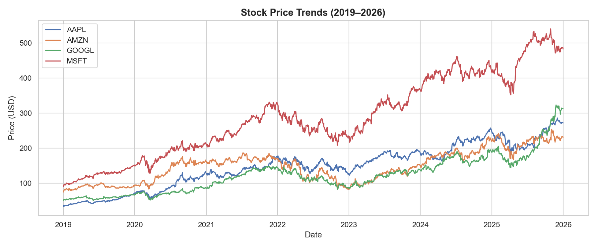
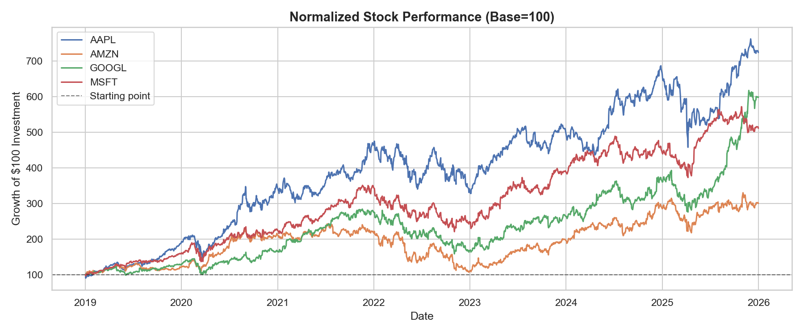
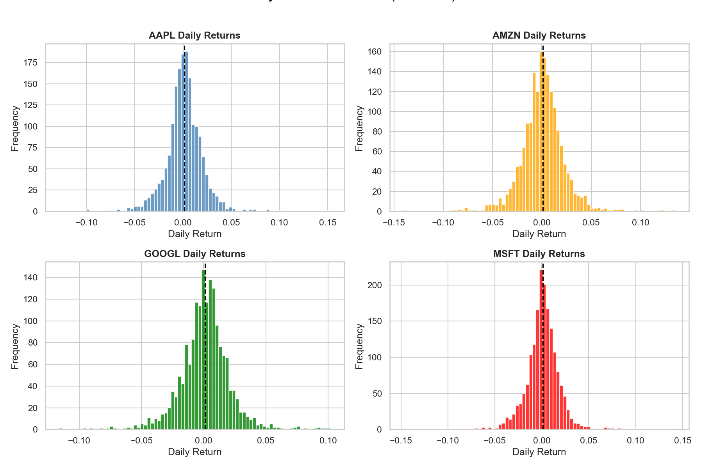
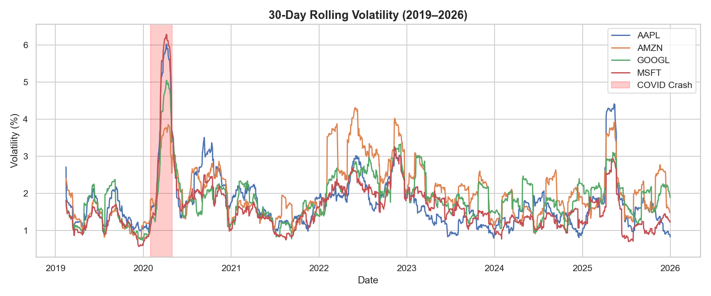

# 💰 Stock Market Performance Analysis (2019–2026)

## Project Overview
Analysis of 5-year stock performance for four major tech companies 
(AAPL, AMZN, GOOGL, MSFT) using real market data fetched directly 
from Yahoo Finance. This project uncovers performance trends, 
risk profiles, and volatility patterns across market cycles.

---

## Business Questions Answered
- Which stock delivered the best return since 2019?
- How does performance compare when starting from equal footing?
- How risky is each stock on a day-to-day basis?
- When were these stocks most volatile and why?

---

## Dataset
- **Source:** Yahoo Finance via `yfinance` Python library
- **Stocks:** AAPL, AMZN, GOOGL, MSFT
- **Period:** January 2019 — January 2026
- **Frequency:** Daily closing prices (1,760 trading days)

---

## Tools & Libraries
- Python 3
- yfinance — real-time market data fetching
- Pandas — data manipulation & returns calculation
- Matplotlib & Seaborn — visualizations
- Jupyter Notebook — analysis environment

---

## Project Structure
```
project-02-finance/
│
├── data/                         # Saved price data (not tracked by Git)
├── notebooks/
│   ├── 01_data_collection.ipynb       # Data fetching & validation
│   └── 02_analysis_and_visualizations.ipynb  # Analysis & charts
├── images/                       # Saved chart outputs
└── README.md
```

---

## Key Findings

### 📈 Finding 1 — Raw Prices Are Misleading
Based on absolute price, MSFT appeared to be the top performer.
Normalization revealed AAPL was the actual winner.



### 🏆 Finding 2 — AAPL: Best Overall Return
A $100 investment in AAPL in January 2019 would be worth ~$730 
by 2026 — outperforming AMZN ($300), MSFT ($510), and GOOGL ($600).



### ⚖️ Finding 3 — AMZN: Worst Risk-Adjusted Performance
AMZN showed the highest daily volatility but delivered 
the weakest 5-year return — the worst risk-reward tradeoff 
of the four stocks analyzed.



### 🌊 Finding 4 — Volatility Spikes Are Market-Wide
COVID crash (March 2020) caused simultaneous volatility spikes 
across all stocks, peaking above 6%. Secondary spikes visible 
during 2022 rate hikes and 2025 macro uncertainty.



---

## Methodology Notes
- Closing prices used for all analysis (most stable daily price)
- Daily returns calculated using `pct_change()`
- Performance normalized to base 100 for fair comparison
- Volatility measured as 30-day rolling standard deviation 
  of daily returns

---

## How To Run This Project
1. Clone this repository
2. Install required library: `pip install yfinance`
3. Run notebooks in order: `01` → `02`
4. Data is fetched live — no manual download needed