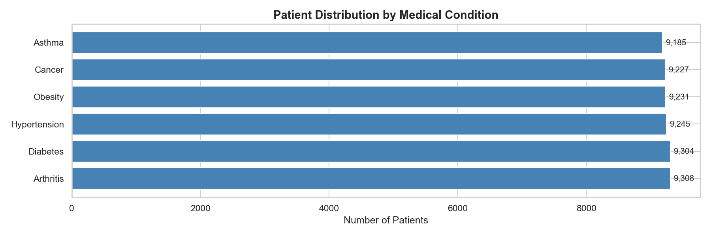
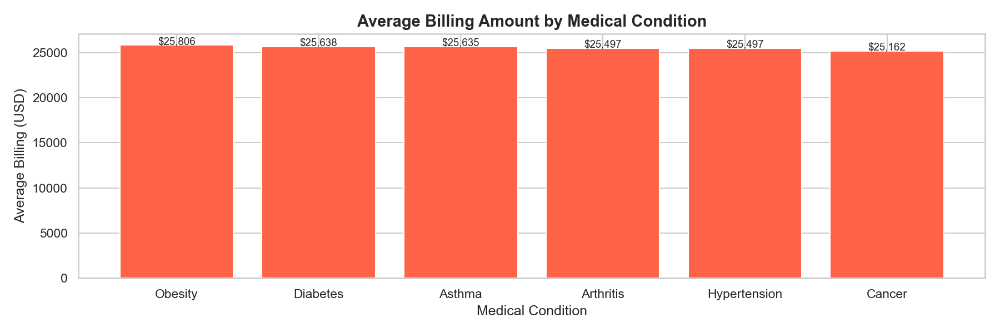
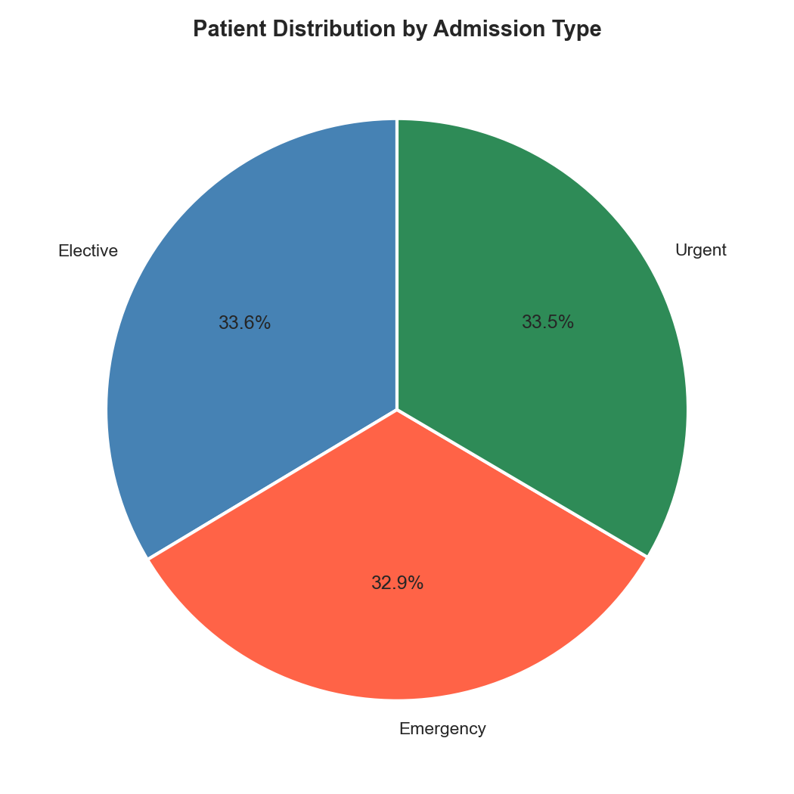
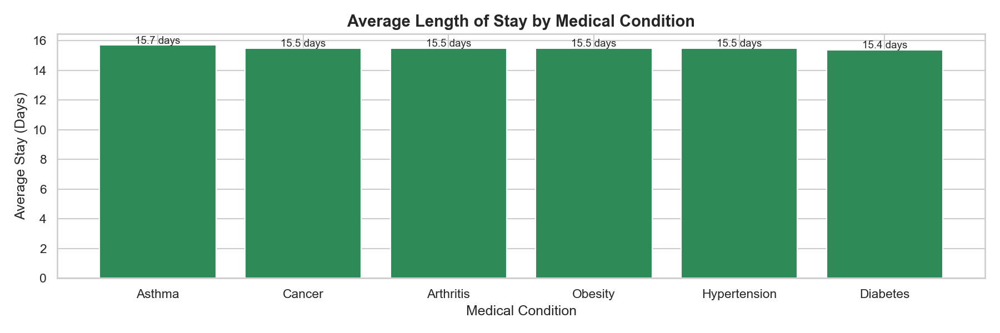

# 🏥 Healthcare Data Analysis — SQL + Python

## Project Overview
Analysis of 55,500 patient records using MySQL and Python to uncover 
insights about medical conditions, billing patterns, hospital stays, 
and treatment outcomes.

---

## Business Questions Answered
- What are the most common medical conditions?
- Which conditions cost the most to treat?
- How does admission type affect billing?
- Which insurance providers cover the most patients?
- How long do patients stay for each condition?
- What medications are prescribed per condition?

---

## Dataset
- **Source:** [Healthcare Dataset — Kaggle](https://www.kaggle.com/datasets/prasad22/healthcare-dataset)
- **Size:** 55,500 patient records × 15 columns
- **Database:** MySQL (via XAMPP)

---

## Tools & Libraries
- MySQL — database storage and SQL analysis
- Python 3 — data pipeline and visualizations
- Pandas + SQLAlchemy — database connectivity
- Matplotlib & Seaborn — visualizations
- Jupyter Notebook — analysis environment

---

## Project Structure
```
project-03-healthcare/
│
├── data/                        # Raw data (not tracked by Git)
├── notebooks/
│   ├── 01_database_setup.ipynb      # ETL pipeline: CSV → MySQL
│   ├── 02_sql_analysis.ipynb        # 10 SQL queries with insights
│   └── 03_visualizations.ipynb     # Charts from SQL results
├── images/                      # Saved chart outputs
└── README.md
```

---

## SQL Skills Demonstrated
- `GROUP BY`, `ORDER BY`, `HAVING`
- Aggregate functions: `COUNT`, `AVG`, `SUM`, `MIN`, `MAX`
- Subqueries
- `CASE WHEN` for data bucketing
- `DATEDIFF` for date calculations
- Window functions: `OVER (PARTITION BY)`

---

## Key Findings

### 🦴 Finding 1 — Balanced Condition Distribution
All 6 conditions affect roughly equal patient proportions (~16.7% each).
Arthritis leads slightly with 9,308 patients.



### 💰 Finding 2 — Obesity Is Most Expensive
Obesity has the highest average billing at $25,806 per patient.
Cancer has the lowest at $25,162 — a $644 difference across conditions.



### 🚑 Finding 3 — Even Admission Type Split
Elective (33.6%), Urgent (33.5%), Emergency (32.9%) — nearly equal.
Elective procedures bill slightly higher than emergency admissions.



### 🛏️ Finding 4 — Asthma Requires Longest Stays
Asthma patients stay an average of 15.7 days vs Diabetes at 15.4 days.
All conditions cluster between 15-16 days — consistent care protocols.



### ⚠️ Data Quality Note
Negative billing amounts detected in the dataset (min: -$2,008).
Likely represents insurance credits or data entry errors.
Flagged for data engineering team review.

---

## How To Run This Project
1. Clone this repository
2. Download the dataset from Kaggle (link above)
3. Set up MySQL via XAMPP
4. Run notebooks in order: `01` → `02` → `03`